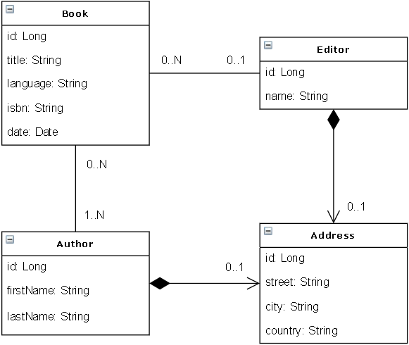

# Spring GraphQL Sample

This is a sample GraphQL backend based on Spring Boot, GraphQL Java (the core GraphQL library
in Java) and GraphQL Java Kickstart (provides Spring Boot integration of GraphQL Java).

For GraphQL see https://graphql.org/.

For GraphQL Java see https://www.graphql-java.com/ and https://github.com/graphql-java/graphql-java.

For GraphQL Java Kickstart see https://www.graphql-java-kickstart.com/ and
https://github.com/graphql-java-kickstart/graphql-spring-boot.

## Features

Uses a simple library oriented domain model:



GraphQL features:
- A single GraphQL schema in `src/main/resources/library.graphqls`
- Queries with or without parameters and default values
- Mutations
- Dates support
- The application embeds GraphiQL, a GraphQL client UI, for easy querying
- Automated tests of queries and mutations
- A Postman configuration file in `postman`

No external database is requires as the application uses an embedded in-memory H2 database.

The business data are in `src/main/resources/data.sql`.

## Usage

As usual run with `mvn spring-boot:run` (or `mvn package` then
`java -jar target/spring-graphql-sample.jar`).

Useful URL:
- http://localhost:8080/ homepage of the application, contains the next links
- http://localhost:8080/graphql/schema.json the GraphQL schema of the application
- http://localhost:8080/graphql?query=%7Bbooks%7Bid%20title%7D%7D a sample GraphQL query
- http://localhost:8080/graphiql the GraphiQL client UI
- http://localhost:8080/h2-console/ the H2 web console

Sample GraphQL queries and mutations (can be copy/pasted in GraphiQL):
```
{
  authors {
    id
    firstName
    lastName
  }
}
```

```
{
  books(page:0, size:3) {
    id
    title
    isbn
  }
}
```

```
{
  booksByLanguage(language:"EN") {
    id
    title
    isbn
  }
}
```

```
mutation {
  createAuthor(firstName: "John", lastName: "Doe") {
    id
  }
}
```

```
mutation {
  updateBook(id: 1001, title: "Some title")
}
```

## Issues

Summary of issues met during development:
- Dates are not directly supported by GraphQL, some coding or third party lib is required
- Upgrading from GraphQL Java Kickstart 5.0.2 to 5.7.0 was more complex than expected
  (different groupId, Maven Central vs JCenter confusion, GraphQL Java Tools not explicitly needed anymore)
- Application initialization with GraphQL Java Kickstart 5.7.0 logs errors, but this does
  not seem to prevent the application from working correctly
- Spring initialization error during tests unless graphql.servlet.websocket.enabled=false
- Server-side integration tests using MockMvc are not supported by GraphQL Java,
  but TestRestTemplate is ok
- Lazy loading of JPA relations is not supported since the DispatcherServlet (that uses
  OpenEntityManagerInViewInterceptor to implement the session-per-request pattern)
  of Spring is not used by GraphQL Java, see https://stackoverflow.com/questions/48037601/lazyinitializationexception-with-graphql-spring
  for alternatives

## Next steps

Not yet implemented:
- Support lazy relations
- Support enumeration
